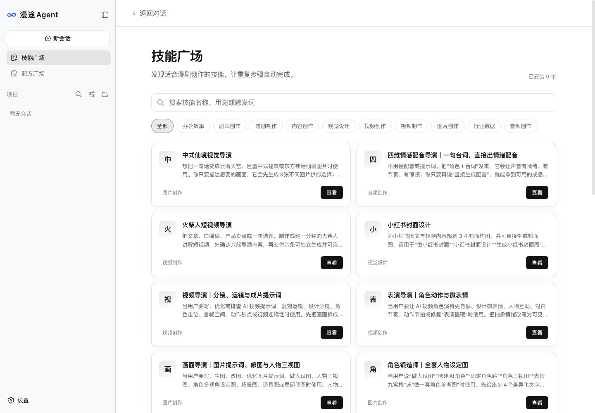

# Mantur Agent · 漫途 Agent

English | [中文](README.zh.md)

An AI desktop workspace for scriptwriting, AI drama production, and creative assets. Bring your scripts and reference files, describe the result you want, and work with the Agent through planning, asset preparation, generation, and editing.

[Download & installation guide](https://guiyi2023.feishu.cn/docx/Iq3id4fr8o2uo9xKfpEcIck9nRf) · [ManturHub](https://hub.mantur.ai) · [Report an issue](https://github.com/mantur-ai/mantur-agent/issues)


## What you can do

| Your task | How Mantur helps |
| --- | --- |
| Develop a script | Discuss story ideas, characters, episode structure, and revisions in a project conversation. |
| Prepare a production | Bring scripts and reference folders; ask the Agent to organize characters, scenes, props, and shot prompts. |
| Generate creative assets | Choose Skills and use connected ManturHub operators for the capabilities required by your task. |
| Reuse a creative approach | Browse the recipe marketplace, select a reference, and adapt its instructions to your content. |
| Continue into editing | Open the integrated editing workbench to work with production materials. |

Available results depend on the selected Skill, model, operator, permissions, and source materials. Review scripts and generated media before delivery; a conversation does not guarantee a finished film.

<details>
<summary>Product screenshots: Skills and recipes</summary>




Actual desktop screenshots from an empty demonstration profile. Marketplace entries and counts change as the service is updated.

</details>

<a id="run"></a>

## Install and start

1. Open the [installation guide](https://guiyi2023.feishu.cn/docx/Iq3id4fr8o2uo9xKfpEcIck9nRf) and download the attachment for your computer. The guide identifies the available version.
2. On **macOS Apple Silicon**, open the DMG and drag the app into Applications. On **Windows x64**, run the EXE and follow the installer. An Intel Mac installer is not currently provided through this guide.
3. Open Mantur Agent. In Settings, configure your model provider and select a model. Use your own provider credentials; an installer does not include a shared model API key.
4. Select a workspace, create a conversation, and add your script or reference materials. Send a specific request and review the Agent’s output.

The Windows installer includes the application runtime; its extraction progress is not another application download. Windows may show an unknown-publisher warning because the supplied installer lacks a Windows signing certificate. The supplied Mac package has Developer ID signing but is not notarized. See the guide for the exact package and installation notes.

## Bring a script or a whole folder

In the desktop app, drag files or folders from Finder or Explorer into the conversation composer. You can also use **Add files** or **Add folder**. Markdown (`.md`), Word (`.doc` / `.docx`), images, audio, and other ordinary files can be imported; nested folders and empty directories are preserved.

The app creates a local copy and adds its path to your draft. Send the message to ask the Agent to read it. Importing a Word document preserves its original bytes; text extraction depends on the Agent’s available document tools. Import is not automatic cloud synchronization. Cloud model and operator calls can send the material needed for the requested task to those services.

Symbolic links and folders containing the app’s own attachment storage are rejected. A failed batch is discarded without changing the originals. Browser-only deployments retain image intake and do not provide the desktop folder-import capability.

Try this first:

> Read the script and reference folder I attached. List the episodes, characters, scenes, and props. Identify missing information, then propose a production plan for episode one. Wait for my confirmation before generating assets.

## ManturHub account and model settings

**Mantur account** connects the desktop to [hub.mantur.ai](https://hub.mantur.ai). Open the account section in Settings and choose browser login; complete website login and device authorization, then return to the app and check that the account is shown as signed in. Merely opening the browser does not complete authorization. Cloud operations require valid authorization and are subject to the platform’s displayed pricing.

**Model settings** select the language model used in conversations and its provider credentials. Mantur account login and model configuration are separate. You can create a local conversation before signing into Mantur; cloud capabilities still require their own authorization.

## Common questions

| Question | What to check |
| --- | --- |
| Why are model settings already filled in? | Settings persist locally across app launches and updates. Existing local settings are not evidence that credentials are embedded in the installer. |
| Why is the advanced configuration file empty? | An empty initial file is expected. Use the account and model screens for ordinary setup; account login does not require editing YAML. |
| Why does login fail? | Keep the error text and application version. A missing-endpoint or incompatible-response error needs a publisher-side check; editing local model keys will not fix it. |
| Why can I only attach images? | Check that you are running the desktop installer with Add files / Add folder, rather than a browser-only deployment. |
| What are `latest-mac.yml` and `.blockmap`? | They are update metadata, not installers. Download the DMG or EXE identified in the guide. |

For a bug report, include the app version, operating system and architecture, reproduction steps, and the full error or a screenshot. Remove credentials and private scripts before posting to [GitHub Issues](https://github.com/mantur-ai/mantur-agent/issues).

<a id="run-from-source"></a>

## Develop and contribute

The repository uses Node.js (`^22.19.0 || >=24.0.0`) and pnpm 11.7.0. Desktop CI uses Node.js 24. The Mantur product launches with the `mantur` profile; the upstream npm package is not the Mantur desktop installer. After setting up the checkout and dependencies using the development guide below, build the Mantur profile with:

```sh
pnpm run build:mantur
```

For native packaging, signing prerequisites, and packaged smoke checks, use the [desktop guide](apps/desktop/README.md). Start code changes with the [development guide](docs/development.md), [architecture](docs/architecture.md), [contribution guide](CONTRIBUTING.md), and [repository instructions](AGENTS.md). Keep drama features in plugins, Skills, and profiles where possible, and include focused tests with changes.

## Open-source foundations and license

Mantur Agent is the Mantur drama-production edition built on [DeepSeek Harness](https://github.com/deepseek-ai/deepseek-harness), developed upstream by DeepSeek AI, and its [Cordis](https://github.com/cordiverse/cordis) plugin architecture. This repository maintains the Mantur product adaptations.

Repository code is under the [MIT License](LICENSE). Third-party components retain their own licenses; see [Third-party notices](THIRD_PARTY_NOTICES.md) and the [desktop distribution requirements](apps/desktop/README.md). The repository license does not replace the terms of bundled editing, media, or cloud services. Read the [safety notice](SAFETY.md) before running source builds.
